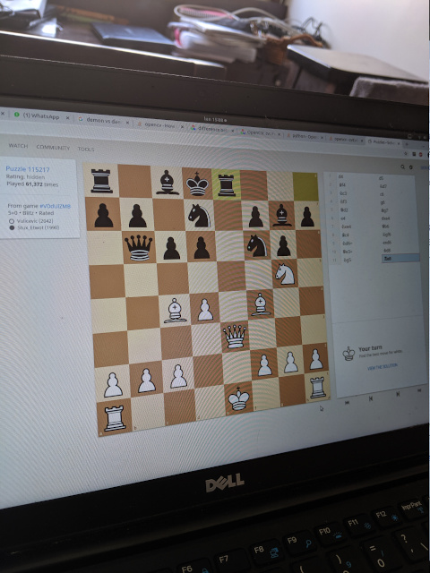

# Chess Game Recognition using Computer Vision

Main tools employed:
- Python
- OpenCV
- Scikit-learn

Board Detection Example:

Original                               |  Warped
:-------------------------------------:|:-------------------------:
  |  

